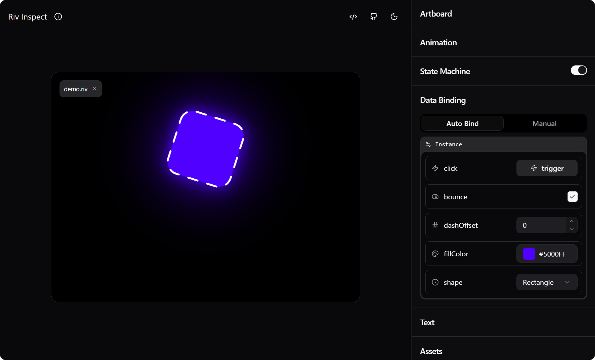
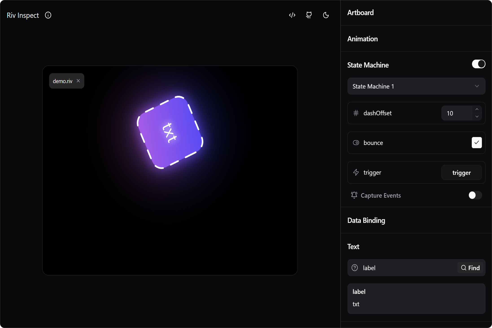

An unofficial tool for developers to inspect rive runtime (`.riv`) files.  Built using Rive React Runtime: `@rive-app/react-webgl2@4.24.0`.

## ✨ Features

- **Artboard**: Preview all artboards
- **Animation**: Control animation playback
- **State Machine**: Interact with state machine inputs (trigger, boolean, and number)
- **Data Binding**: 
  - View and edit view model properties
  - Support for all property types (boolean, number, string, color, enum, image, artboard, nested view models, lists)
  - Auto-bind or manual instance binding
- **Text Run**: Find and modify text content
- **Asset Loading**: Swap image, font, or audio assets
- **Code Generation**: Get ready-to-use code snippets for:
  - Web (vanilla JS)
  - React

 

## ⚠️ Limitations

- View model list item removal may not update visually for newly added items

 

*Not affiliated with Rive. For official documentation, visit [rive.app/docs](https://rive.app/docs)*